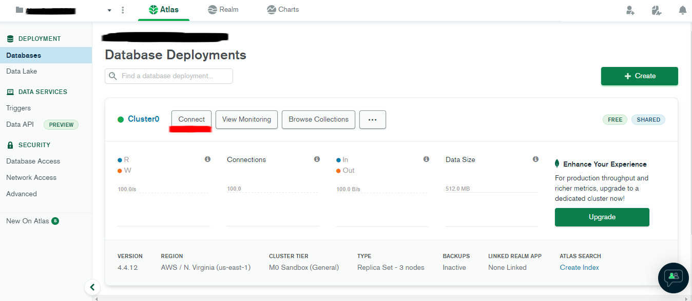
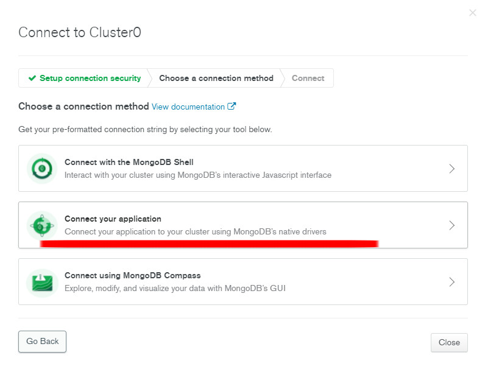
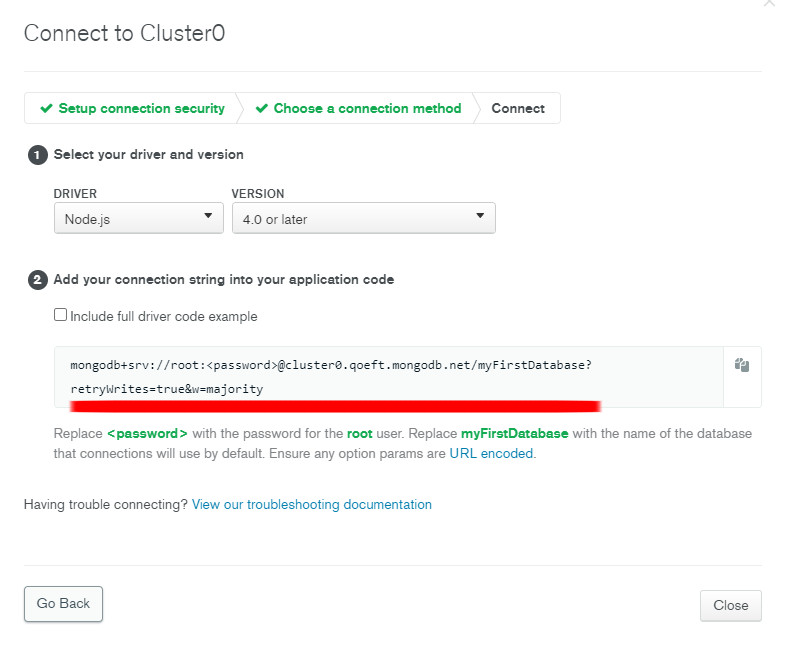

PROJETO AINDA EM CONSTRUÇÃO!!!

Funcionalidades já implementadas:
- Página inicial com login (com autenticação no banco de dados)
- Pagina de Cadastro de novo usuário (com stepper)
- Página de edição de código com highlight

Ainda falta:
- Implementação do "salvar" código na página de Edição de código
- Implementaçao da listagem e pesquisa de projetos na página Comunidade

--------------------------------------------------------------------------------
Adição de funcionalidades ao projeto AluraChallenge.

Alura Chalenge SPA, utilizando React JS, node JS e MongoDB.

Tecnologias utilizadas:
- React JS
- Node JS
- MongoDB
- API's

--------------------------------------------------------------------------------

Passo a passo para visualização do projeto

- Clonar o repositório usando o comando:
    git clone https://github.com/EtorLucca/AluraChallenge-SPA.git

- Usar um cluster MongoDB já criado ou Criar um cluster no MongoDB - Atlas com:
    - Username e password de sua preferência
    - Endereço de IP Atual

- Ainda no MongoDB, conectar a sua aplicação ao cluster:
    
    

- Copiar a uri fornecida:
    

- Criar na pasta server um arquivo .env com o seguinte texto:
      MONGODB_URI=

      APP_SECRET=
    
    - Colar a uri copiada no passo anterior
      MONGODB_URI=uricopiadaaqui

    -Substitua "<password>" pela senha cadastrada na hora da criação do cluster

    - Criar uma sting forte (pode ser usado geradores de string) e inserir no app_secret:
      exemplo: APP_SECRET=abc123

- Abra um terminal do VS Code na pasta server e digite o comando:
    npm run dev
  ou
    yarn dev

- Abra um terminal do VS Code na pasta web e digite o comando:
    npm install
  ou
    yarn add
  para instalar todos as dependencias do projeto

- Após a instalação dos pacotes digite o comando:
    npm start
  ou
    yarn start

O VS Code irá abrir o navegador com o site rodando
      
Cadastrar um usuário na página de cadastro e ultilizar esse usuário para fazer login no sistema.
